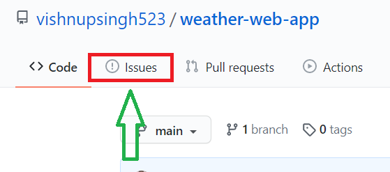
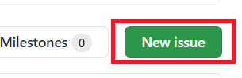
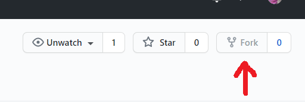

# weather-web-app

<a href="https://github.com/vishnupsingh523/weather-web-app">Reposiotry Link</a>

<h3>This is a weather app which will give the status of any city or gives the weather information of any city entered in its terminal.
Guys I want your help to make this website more effective and fully responsive ... new issues and those who wanted to contribute in this are welcome any time.
</h2>

 
# How to contribute?

<h3>#1: How to create <a href="https://github.com/vishnupsingh523/weather-web-app/issues">Issues</a>:</h3>

- Go to this link and create issue of your choice or work on them which are already there.

- To create Issues click on " new Issues "

 

<h3>#2: How to contribute in this project?</h3>

- Comment in any issue in which you are interested, and that will be assigned accordingly.

- Fork the repository to your gihub account.

- Clone that repository to your local system and then make changes what ever you want and then commit the changes to your main repo.

- At the end Create pull request.

# Our Responsibilities

Project maintainers are responsible for clarifying the standards of acceptable behavior and are expected to take appropriate and fair corrective action in response to any instances of unacceptable behavior.

Project maintainers have the right and responsibility to remove, edit, or reject comments, commits, code, wiki edits, issues, and other contributions that are not aligned to this Code of Conduct, or to ban temporarily or permanently any contributor for other behaviors that they deem inappropriate, threatening, offensive, or harmful